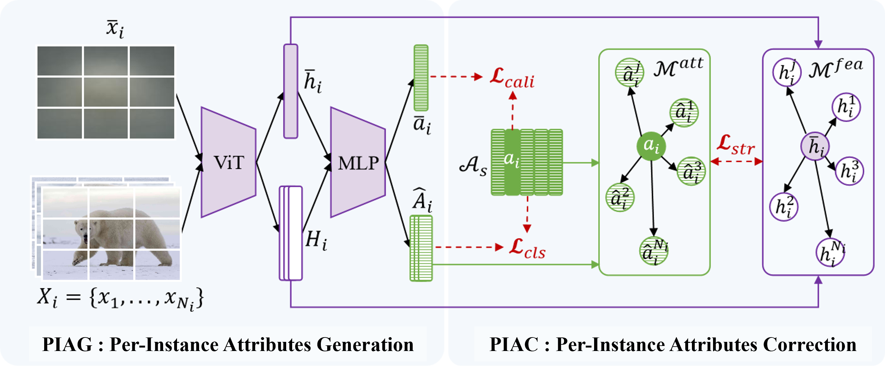

# PIAS
Code for the paper:
Rethinking Generalized Zero-Shot Learning: A Synthesized Per-Instance Attribute Perspective

# PIAS_Framework


# Data of AWA2
Download the AWA2 dataset https://cvml.ista.ac.at/AwA2/

# Prerequisites
pip install torch torchvision numpy scipy tqdm timm

# Reproduce Results
```
python3 train_pias.py
```

