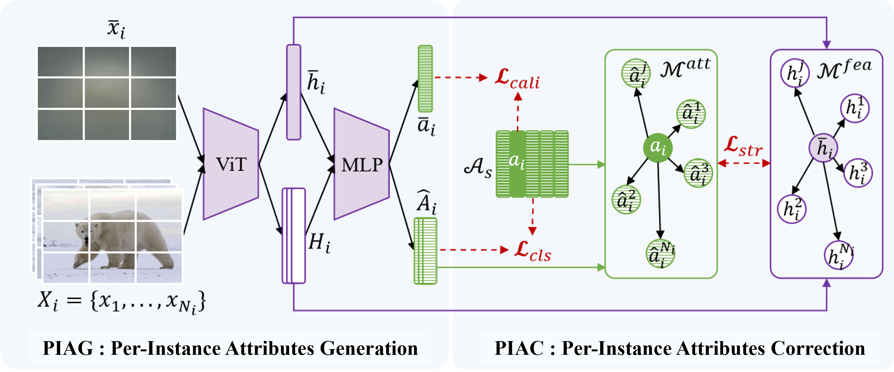

# PIAS
Code for the paper:
Rethinking Generalized Zero-Shot Learning: A Synthesized Per-Instance Attribute Perspective

# PIAS_Framework


# Data of AWA2
Download the AWA2 dataset https://cvml.ista.ac.at/AwA2/

# Prerequisites
pip install torch torchvision numpy scipy tqdm timm

# Reproduce Results
```
python3 train_pias.py
```
# Citing 
```
@article{tang2025rethinking,
  title={Rethinking Generalized Zero-Shot Learning: A Synthesized Per-Instance Attribute Perspective},
  author={Tang, Chenwei and Wang, Ying and Xie, Wei and Zhang, Qianjun and Xiao, Rong and He, Zhenan and Lv, Jiancheng},
  journal={IEEE Transactions on Image Processing},
  year={2025},
  publisher={IEEE}
}
```

